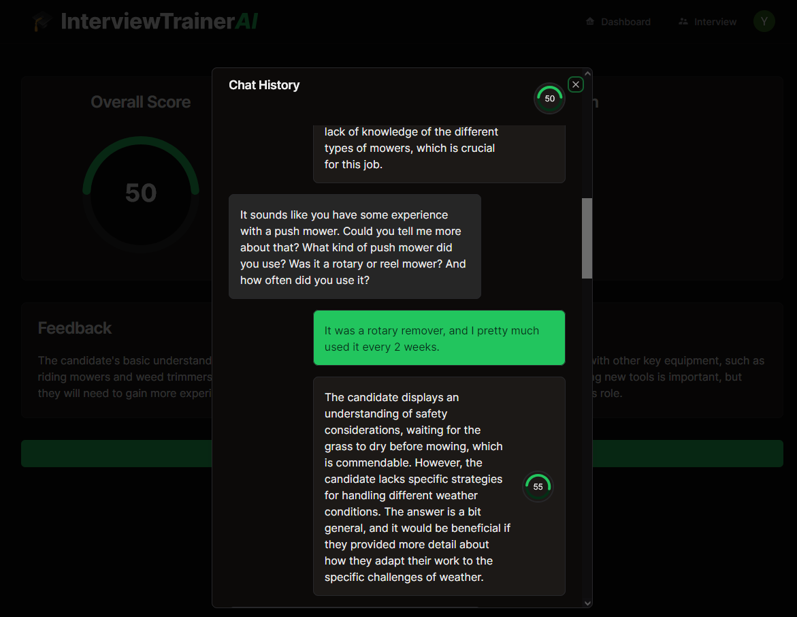

# Team AI Amigos Presents - Interview Trainer AI
[App Link](https://chimerical-liger-1f1422.netlify.app/ "App Link") 


## Instructions
- Sign up

 
<br>

- Click on the Interview Tab 

 
<br>

- Enter job description, the more descriptive the better !

 
<br>

- Upload Resume and pick the desirable settings.

 
<br>

- Finish the interview and select result to view results.
<br>

 
<br>

- Click the "View Detailed Chat Logs" button for feedback on each user response
<br>

 


## For developers

### How to run Emulator:
Inital Setup
- run 
  ```
  npm install firebase-functions@latest firebase-admin@latest --save
  npm install -g firebase-tools
  ```
- update .env file (inside functions folder) to add Deepgram API Key: DEEPGRAM_API_KEY
- Inside functions folder run: 
  ```
  npm i 
  ```
Running Emulator:
- In base folder run 
  ```
  npm run emulator
  ```
  If you are making changes inside functions folder then make sure to also run:
  ```
  npm run build:watch
  ```

### Frontend
- Get the .env file
- ```
  npm i && npm run dev
  ```
